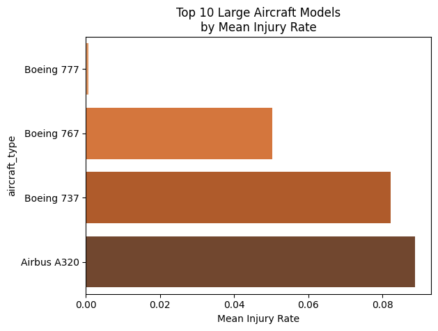
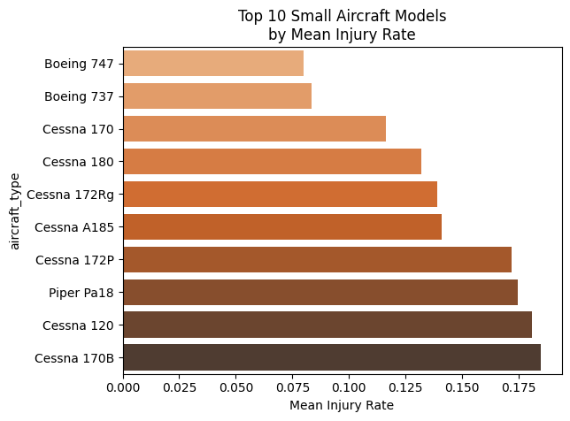
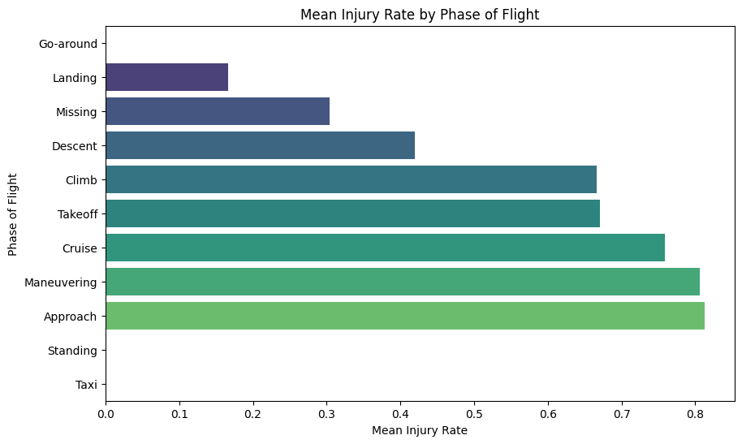

# Aviation Accident Analysis
This project provides a comprehensive analysis of aviation accident data (1948–2023) to identify aircraft makes and models with superior safety records (p. 1). It is designed for aviation insurers to determine which platforms exhibit low rates of total destruction and lower likelihoods of serious passenger injuries (p. 1).
------------------------------
## 🛫 Analysis Summary## 1. Data Cleaning & Scope

* Timeframe: Focused on data from 1983 onwards to reflect modern, active aircraft with a 40-year maximum lifetime (p. 1).
* Target: Excluded amateur-built aircraft, focusing strictly on professional builds (p. 1).
* Segmentation: Data was split into Small Aircraft ($\leq$ 20 passengers) and Large Passenger Models ($>$ 20 passengers) to provide tailored recommendations (p. 2).

## 2. Key Findings

* Large Aircraft Safety: Airbus and Boeing emerged as the safest manufacturers (p. 6). Specifically, the Boeing 777 showed the strongest safety record with the lowest mean injury rate (pp. 8-9).
* Small Aircraft Risk: Models like Maule, Grumman, and Aviat had the lowest injury rates in their class, though small aircraft generally carry 2–10 times higher injury fractions than large commercial jets (pp. 6, 8).
* Risk Factors:
* Phase of Flight: Maneuvering and Approach phases were identified as the most injurious (p. 10).
   * Weather: Accidents in Instrument Meteorological Conditions (IMC) resulted in substantially higher injury rates compared to Visual Meteorological Conditions (VMC) (p. 11).

------------------------------
## 📊 Key Visualizations## Safety by Aircraft Model
The analysis highlighted a clear disparity between commercial airliners and general aviation. While the Boeing 777 exhibited near-zero mean injury rates, small models like the Cessna 170B showed much higher variability and risk.

## Injury Risk by Flight Phase
A critical insight for insurers is that "Maneuvering" and "Approach" are statistically more dangerous than the "Takeoff" or "Landing" phases themselves (p. 10).

------------------------------
## 🛠️ Project Structure

* Aviation_Accidents_Cleaning.ipynb: Initial data ingestion, filtering for professional builds (post-1983), and feature engineering (p. 1).
* Aviation_Accidents_Data_Analysis.ipynb: Detailed EDA, safety metric calculations (destruction rates and injury fractions), and final recommendations (p. 2).

